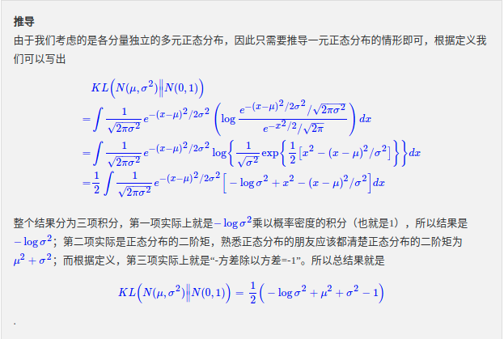
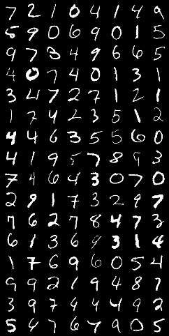
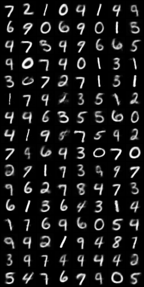
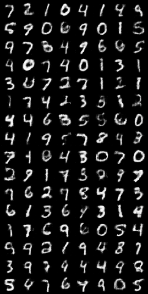
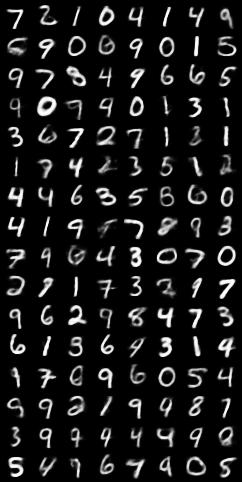

## Auto-Encoder and VAE
### 1. AUto-Encoder

### 2. VAE
#### 1. 模型介绍

#### 2. KL损失函数

### 3. 模型比较
下图从左至右分别为**原始图像**，**MLP_AE生成的图像**，**Conv_AE生成的图像**，**VAE生成的图像**

从下图我们可以看出**Conv_AE生成的图像**，**VAE生成的图像** 优于 **MLP_AE生成的图像**

   

### 4. 参考
- [花式解释AutoEncoder与VAE](https://zhuanlan.zhihu.com/p/27549418)
- [VAE中的损失函数-impact of the loss function](https://zhuanlan.zhihu.com/p/345360992)
- [变分自编码器（一）：原来是这么一回事](https://spaces.ac.cn/archives/5253)